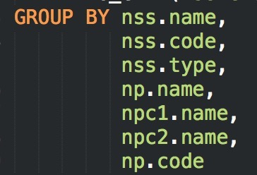

# 索引相关:

#### 1.尽量不用null判断,因为null的话会全表遍历，而不是使用索引，如果是字符串可以  >’',id可以>0

#### 2.避免在where条件用or，如果一个有索引一个没有可以分开查用union，否则会变成全表查询

#### 3.有些情况可以用exists替换in，exists会先循环外部，在查子查询，in 是做hash连表查询，如果外部表比子查询的表小很多，exists会比较快

#### 4.避免在where语句中使用函数和表达式

```
eg:where to_char(created_at, 'yyyy-mm-dd') = '2017-04-17'
    改成 created_at>=2017-04-17 00:00:00 and created_at<=2017-04-17 24:00:00，
    用表达式或函数的时候不会用索引
```

#### 5.如果是复合索引，最好条件和索引顺序一样

#### 6. 最好不使用like

> 1). like %keyword  索引失效，使用全表扫描。
> 但可以通过翻转函数+like前模糊查询+建立翻转函数索引=走翻转函数索引，不走全表扫描。 (待研究)

> 2). like keyword%    索引有效。

> 3). like %keyword% 索引失效，也无法使用反向索引。


#### 7.group使用

> 

> group 无非就是想分组计算并且想拿到nss的name,code,type和np的name,code

> 这里可以先group nss和np的id

> 然后在外面再join nss,np

> 因为分组的同时还会排序,这里对name,code,type这些字段排序实际上都是无用功
