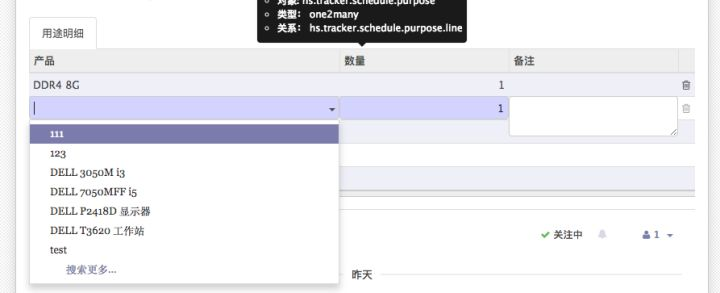

# [odoo]one2many搜索去重实现

> 写在前面: 代码里面去重是用not in实现, 因此会丢失索引, 对大数量级速度可能不太理想,不过没有个几百万记录都没什么感觉吧~~

> 场景: 我们有时候对于one2many选择的时候,只想单选

> 比如图中我选择了DDR4 8G以后,不想再让它出现在搜索列表中,实现步骤如下:




### 1.在所在的模块新增一个py文件, 将下面的代码复制到里面
> 如: [search_enhance.py](../../odoo_script/search_enhance.py)

```python
# -*- coding: utf-8 -*-
import logging
_logger = logging.getLogger(__name__)


def get_ignore_ids(env, item_line, obj_name, field_name, context=None):
    """
    本方法抽象出来,
    用于实现下拉搜索去重的功能,
    只需要copy到对应的对象下
    需要在对应字段的标签里添加

    context="{'de-duplication':parent.line_ids, 'obj_name':'obj_name', 'field_name':'product_id'}"
        其中:
            de-duplication: 是主档对应的字段
            obj_name: 该明细的对象名
            field_name: 字段名

    :param env: 环境变量
    :param item_line: 页面已经缓存的明细, 包括已经在数据库
    :param obj_name: 该明细的对象名
    :param field_name: 字段名
    :param context: ~
    :return: res 忽略的id列表
    """

    _logger.info('* Enhance the search function of <%s> by Roger!!' % obj_name)

    res = []
    line_obj = env[obj_name]

    def _append_ignore_ids(obj_id):
        """
        :param obj_id:
        :return:
        """
        for _line in line_obj.search([('id', '=', obj_id)]).read([field_name]):
            res.append(_line[field_name][0])

    for item in item_line:
        if item and int(item[0]) == 4:
            _append_ignore_ids(item[1])
        if item and int(item[0]) in [0, 1] and isinstance(item[2], dict):
            if item[2].get(field_name, False):
                res.append(item[2][field_name])
            else:
                _append_ignore_ids(item[1])
    return res


def get_search_args(args, env, context):
    """
    获得search 参数
    :param args:
    :param env:
    :param context:
        de-duplication:
        obj_name:
        field_name:
    :return:
    """
    if context.get('de-duplication', False) and context.get('obj_name', False) and context.get('field_name', False):
        _ignore_ids = get_ignore_ids(env, context['de-duplication'], context['obj_name'], context['field_name'])
        args.append(['id', 'not in', _ignore_ids])
    return args
```    

### 2.在要实现的对象里面重写search 和 name_search方法

```python
# import 上面的代码
from search_enhance import get_search_args

@api.model
def search(self, args, offset=0, limit=None, order=None, count=False):
    args = get_search_args(args, self.env, self._context)
    return super(ClazzName, self).search(args, offset=offset, limit=limit, order=order, count=count)

@api.model
def name_search(self, name='', args=None, operator='ilike', limit=100):
    args = get_search_args(args, self.env, self._context)
    return super(ClazzName, self).name_search(name=name, args=args, operator=operator, limit=limit)

```

### 3.在你需要实现去重的页面对应的o2m字段里面添加context

```xml
<!--
     de-duplication: 是主档对应的字段
     obj_name: 该明细的对象名
     field_name: 当前字段名
-->
<field name="product_id" context="{'de-duplication':parent.line_ids, 'obj_name':'xx.products', 'field_name':'product_id'}"/>
```

### 4.代码里面去重是用not in实现, 对大数量级速度可能不太理想,不过没有个几百万记录都没什么感觉吧~~
