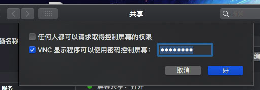
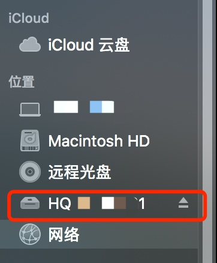
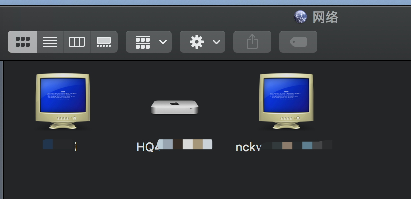

# mac os 之间屏幕共享

### 1. 被链接端

- 点击`系统偏好设置` - `共享` - `屏幕共享`
- 打开电脑设置
  - 勾选`VNC.....`并设置连接密码
  - 

### 2. 连接端

- 打开`Finder`(`访达`)
- 

- 如图中, 看到需要连接的电脑

- 如果没有看到, 点击`网络`

  - 

  - 双击
  - 

  - 点击共享屏幕稍等一会就可以连接到