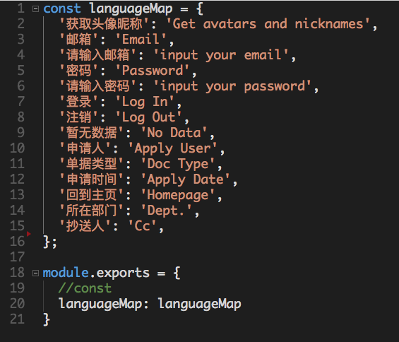
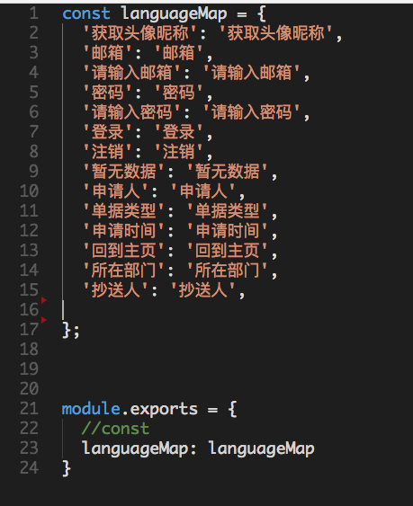

# 微信小程序支持多语言

### 1.先在login页面添加一个带有点击事件的view,

```xml
<zan-col col="10" offset="2" class="choose-language" bindtap="switchLanguage">{{language}}</zan-col>
```

### 2.switchLanguage / onLoad func如下

```java
  onLoad: function () {
  	// 登录页面切换中英文需要
    if (base.getLanguage() == 'zh_CN') {
      this.setData({
        language: 'English',
      })
    } else {
      this.setData({
        language: '中文',
      })
    };
  }	

  switchLanguage: function() {
    if (base.getLanguage() == 'zh_CN'){
      console.log('切换至英文');
      wx.setStorageSync('Language', 'en'); // 利用本地缓存存放用户中英文选项
    }else{
      console.log('切换至中文');
      wx.setStorageSync('Language', 'zh_CN');
    };
    wx.navigateTo({
      url: 'index',
    });
  },
```
  
### 3.小程序根目录添加目录i18n

- 新建 en_US.js; zh_CN.js 两个文件分别存放英文和中文的对照, 如图:

#### en_US.js



#### zh_CN.js




### 4.根目录新建一个js文件, 姑且先叫做base.js, 通用的一些函数可以放在此文件

```java
function getLanguage() {
  //返回缓存中的language属性 (en / zh_CN) 	
  return wx.getStorageSync('Language') || 'zh_CN'
};

function translate(){
  //返回翻译的对照信息
  return require('i18n/'+ getLanguage() + '.js').languageMap;
}

function translateTxt(desc){
  //翻译	
  return translate()[desc] || '竟然没有翻译';
}

module.exports = {
  getLanguage: getLanguage,
  t: translate,
  _: translateTxt,
}
```

### 5.相关页面的js文件需要修改

```java
var base = require('../../base.js');  //路径可能做相应调整
const _ = base._; //翻译函数


  onLoad: function () {
    // 登录页面切换中英文需要
    if (base.getLanguage() == 'zh_CN') {
      this.setData({
        language: 'English',
      })
    } else {
      this.setData({
        language: '中文',
      })
    };
    this.setData({
      t: base.t(), //翻译
    });
  }
```

### 6.以上准备工作已经做好 下面就是调整需要的翻译的地方

* *.wxml 文件中, 例:

```xml
<zan-button type="primary" bindtap="go2login">登录</zan-button>
```

变更成

```xml
<zan-button type="primary" bindtap="go2login">{{ t['登录'] }}</zan-button>
```

* *.js 文件中, 例:

```java
wx.setNavigationBarTitle({
	title: '登录'
});
```

变更成

```java
wx.setNavigationBarTitle({
	title: _('登录')
});
```

### PS:
- 我曾想把wxml和js文件都统一成_('')的方式, 但是wxml里面不能传递函数, 所以只能把json对象传过去了
